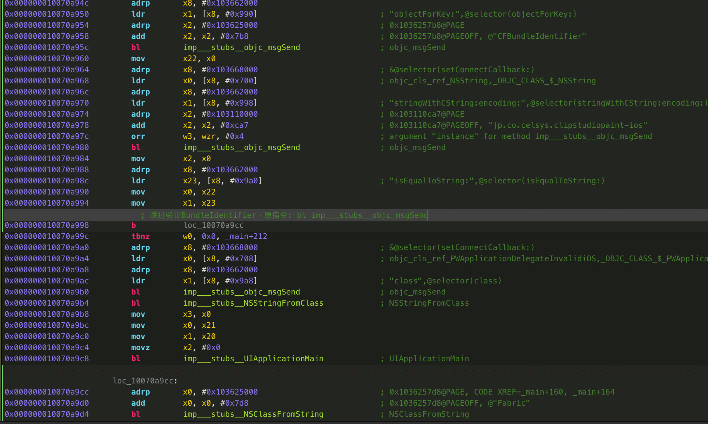
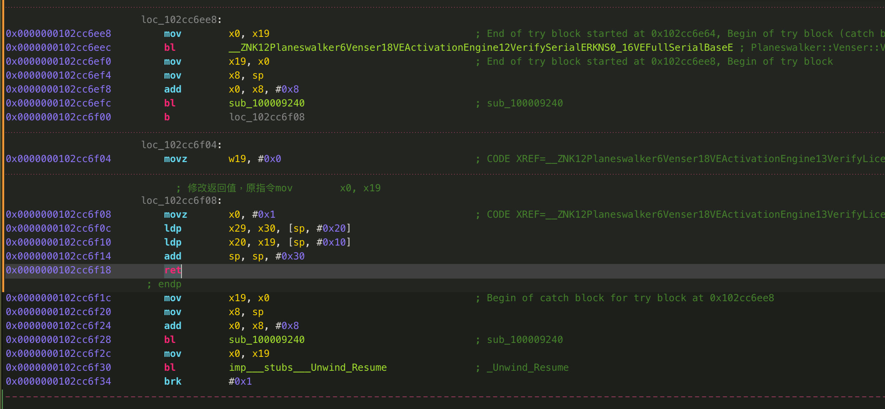
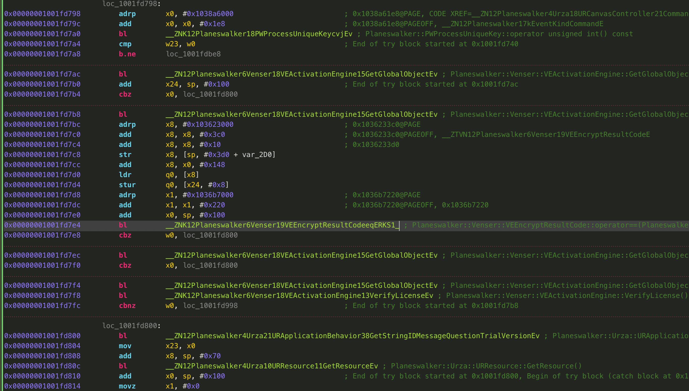
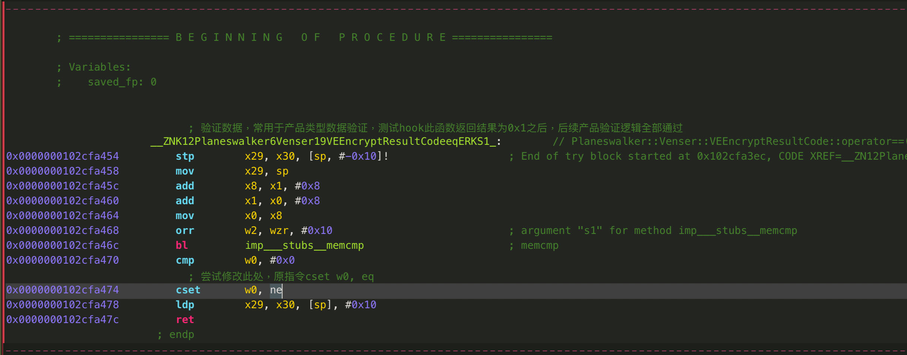
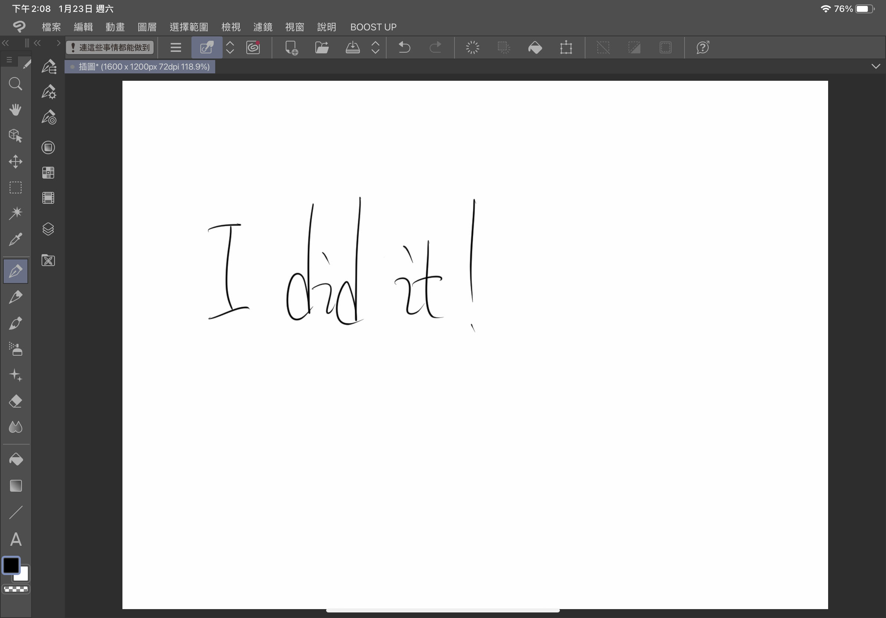
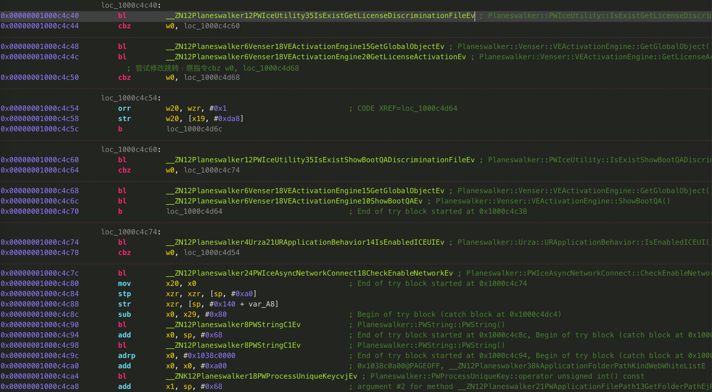
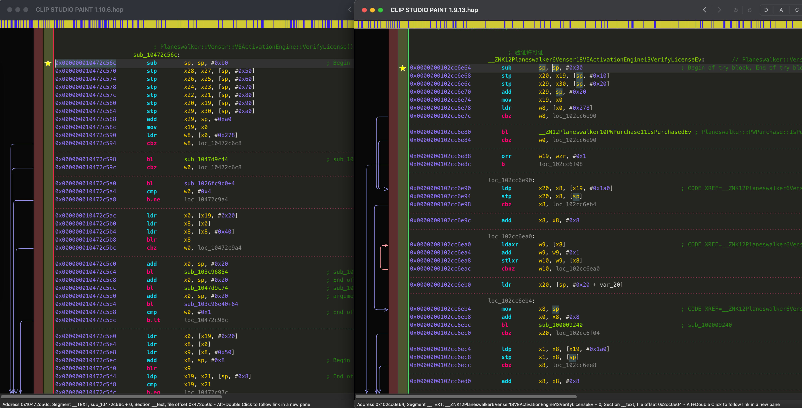

# ClipStudioPaintForIOS-Reverse-Engineering-Notes
# 逆向Clip Studio Paint For iPad 1.9.13笔记:

### 需要注意的点:
* Clip Studio Paint考虑到跨平台的因素，其UI使用OpenGL图形API开发，无法使用Reveal进行分析
* 应用的大部分逻辑不在OC，大多在C中实现
* 应用包体很大(400M+)，每次编译部署到实机上会花费很久时间(还好有了M1芯片的Mac，可以直接在Mac上运行)

### 开始
* 砸壳得到解密版二进制MachO文件
* 使用MonkeyDev自签运行到设备:
	* 运行后提示"Invalid Binary": 猜测CSP中可能使用了二进制修改验证，需要绕过验证机制
* 尝试绕过"Invalid Binary"对话框:
	* 从Hopper中搜索字符串"Invalid Binary"，找到在PWApplicationDelegateInvalidiOS类的实例方法applicationDidFinishLaunching中引用了这个字符串
	* 但是在Hopper中无法进一步查找出是从哪里调用了这个函数，尝试在运行时打印调用堆栈查找:
	* 在MonkeyDev的Dylib工程入口点中添加初始化hook逻辑

> 打印当前调用堆栈的函数

```objective-c
#import <execinfo.h>
#import <unistd.h>

void PrintCallStack () {
	void *stackAdresses[64];
	int stackSize = backtrace(stackAdresses, 64);
	backtrace_symbols_fd(stackAdresses, stackSize, STDOUT_FILENO);
}
```

> 使用Aspect库实现在PWApplicationDelegateInvalidiOS::applicationDidFinishLaunching方法调用之前先打印一下调用堆栈

```objective-c
%ctor {
		NSLog(@"----inject success----");

		Class targetClass = objc_getClass([@"PWApplicationDelegateInvalidiOS" UTF8String]);
        if ( targetClass != nil ) {
            [targetClass aspect_hookSelector:@selector(applicationDidFinishLaunching:) withOptions:AspectPositionBefore usingBlock:^(id<AspectInfo> aspectInfo, id arg1) {
                
                NSLog(@"----aspect hook success----");
                NSLog(@"----arg1: %@---", arg1);
                
                PrintCallStack ();
                
            } error:NULL];
        }
}
```
						
> 运行后我们得到输出结果:

```
2021-01-24 13:38:12.512061+0800 CLIP STUDIO PAINT[1815:2854279] ----aspect hook PWApplicationDelegateInvalidiOS::applicationDidFinishLaunching:----
2021-01-24 13:38:12.512146+0800 CLIP STUDIO PAINT[1815:2854279] ----arg1: <UIApplication: 0x147a098e0>---
0   libMyClipStudioPaintDylib.dylib     0x000000010707fca8 PrintCallStack + 52
1   libMyClipStudioPaintDylib.dylib     0x000000010707fe40 __HookClassMethodPrintBT_block_invoke.37 + 188
2   CoreFoundation                      0x000000019c94c894 __invoking___ + 148
3   CoreFoundation                      0x000000019c94c71c -[NSInvocation invoke] + 448
4   CoreFoundation                      0x000000019c980234 -[NSInvocation invokeWithTarget:] + 80
5   libMyClipStudioPaintDylib.dylib     0x0000000107061a04 -[AspectIdentifier invokeWithInfo:] + 756
6   libMyClipStudioPaintDylib.dylib     0x0000000107065c14 __ASPECTS_ARE_BEING_CALLED__ + 2956
7   CoreFoundation                      0x000000019c94aec0 ___forwarding___ + 736
8   CoreFoundation                      0x000000019c94ab30 _CF_forwarding_prep_0 + 96
9   UIKitCore                           0x00000001bfc4fb7c -[UIApplication _handleDelegateCallbacksWithOptions:isSuspended:restoreState:] + 464
10  UIKitCore                           0x00000001bfc4f410 -[UIApplication _callInitializationDelegatesWithActions:forCanvas:payload:fromOriginatingProcess:] + 5152
11  UIKitCore                           0x00000001bfc4cadc -[UIApplication _runWithMainScene:transitionContext:completion:] + 1316
12  UIKitCore                           0x00000001bfc4c4a0 -[_UISceneLifecycleMultiplexer completeApplicationLaunchWithFBSScene:transitionContext:] + 128
13  UIKitCore                           0x00000001bfc478dc _UIScenePerformActionsWithLifecycleActionMask + 112
14  UIKitCore                           0x00000001bfc4bb20 __101-[_UISceneLifecycleMultiplexer _evalTransitionToSettings:fromSettings:forceExit:withTransitionStore:]_block_invoke + 224
15  UIKitCore                           0x00000001bfc4b888 -[_UISceneLifecycleMultiplexer _performBlock:withApplicationOfDeactivationReasons:fromReasons:] + 484
16  UIKitCore                           0x00000001bfc4aaa8 -[_UISceneLifecycleMultiplexer _evalTransitionToSettings:fromSettings:forceExit:withTransitionStore:] + 772
17  UIKitCore                           0x00000001bfc4a6d8 -[_UISceneLifecycleMultiplexer uiScene:transitionedFromState:withTransitionContext:] + 340
18  UIKitCore                           0x00000001bfc481c0 __186-[_UIWindowSceneFBSSceneTransitionContextDrivenLifecycleSettingsDiffAction _performActionsForUIScene:withUpdatedFBSScene:settingsDiff:fromSettings:transitionContext:lifecycleActionType:]_block_invoke + 196
19  UIKitCore                           0x00000001bfc48c2c +[BSAnimationSettings(UIKit) tryAnimatingWithSettings:actions:completion:] + 892
20  UIKitCore                           0x00000001bfc48310 _UISceneSettingsDiffActionPerformChangesWithTransitionContext + 272
21  UIKitCore                           0x00000001bfc47d28 -[_UIWindowSceneFBSSceneTransitionContextDrivenLifecycleSettingsDiffAction _performActionsForUIScene:withUpdatedFBSScene:settingsDiff:fromSettings:transitionContext:lifecycleActionType:] + 384
22  UIKitCore                           0x00000001bfc472dc __64-[UIScene scene:didUpdateWithDiff:transitionContext:completion:]_block_invoke + 776
23  UIKitCore                           0x00000001bfc4698c -[UIScene _emitSceneSettingsUpdateResponseForCompletion:afterSceneUpdateWork:] + 256
24  UIKitCore                           0x00000001bfc467bc -[UIScene scene:didUpdateWithDiff:transitionContext:completion:] + 248
25  UIKitCore                           0x00000001bfc3a1c0 -[UIApplication workspace:didCreateScene:withTransitionContext:completion:] + 564
26  UIKitCore                           0x00000001bfc39ef8 -[UIApplicationSceneClientAgent scene:didInitializeWithEvent:completion:] + 388
27  FrontBoardServices                  0x00000001ace4db60 -[FBSScene _callOutQueue_agent_didCreateWithTransitionContext:completion:] + 432
28  FrontBoardServices                  0x00000001ace6d6a4 __94-[FBSWorkspaceScenesClient createWithSceneID:groupID:parameters:transitionContext:completion:]_block_invoke.200 + 128
29  FrontBoardServices                  0x00000001ace3b714 -[FBSWorkspace _calloutQueue_executeCalloutFromSource:withBlock:] + 240
30  FrontBoardServices                  0x00000001ace6d368 __94-[FBSWorkspaceScenesClient createWithSceneID:groupID:parameters:transitionContext:completion:]_block_invoke + 372
31  libdispatch.dylib                   0x0000000108451d20 _dispatch_client_callout + 20
32  libdispatch.dylib                   0x0000000108455f50 _dispatch_block_invoke_direct + 392
33  FrontBoardServices                  0x00000001ace3b5fc __FBSSERIALQUEUE_IS_CALLING_OUT_TO_A_BLOCK__ + 48
34  FrontBoardServices                  0x00000001ace892a8 -[FBSSerialQueue _targetQueue_performNextIfPossible] + 448
35  FrontBoardServices                  0x00000001ace3b59c -[FBSSerialQueue _performNextFromRunLoopSource] + 32
36  CoreFoundation                      0x000000019c96bc14 __CFRUNLOOP_IS_CALLING_OUT_TO_A_SOURCE0_PERFORM_FUNCTION__ + 28
37  CoreFoundation                      0x000000019c96bb60 __CFRunLoopDoSource0 + 208
38  CoreFoundation                      0x000000019c96b84c __CFRunLoopDoSources0 + 268
39  CoreFoundation                      0x000000019c96a1e4 __CFRunLoopRun + 824
40  CoreFoundation                      0x000000019c969740 CFRunLoopRunSpecific + 600
41  HIToolbox                           0x00000001a4486678 RunCurrentEventLoopInMode + 292
42  HIToolbox                           0x00000001a44864a8 ReceiveNextEventCommon + 688
43  HIToolbox                           0x00000001a44861d8 _BlockUntilNextEventMatchingListInModeWithFilter + 76
44  AppKit                              0x000000019f141da4 _DPSNextEvent + 868
45  AppKit                              0x000000019f140724 -[NSApplication(NSEvent) _nextEventMatchingEventMask:untilDate:inMode:dequeue:] + 1312
46  AppKit                              0x000000019f13260c -[NSApplication run] + 600
47  AppKit                              0x000000019f103db0 NSApplicationMain + 1064
48  AppKit                              0x000000019f3f5c28 +[NSWindow _savedFrameFromString:] + 0
49  UIKitMacHelper                      0x00000001af54feac UINSApplicationMain + 1276
50  UIKitCore                           0x00000001bfc1e720 UIApplicationMain + 164
51  CLIP STUDIO PAINT                   0x0000000102abe9cc CLIP STUDIO PAINT + 7383500
52  libdyld.dylib                       0x000000019c88cf34 start + 4
```

* 分析调用堆栈:
	* 调用帧51调用了一个"CLIP STUDIO PAINT + 7383500"这个函数，但是不清楚这个13997540是文件偏移还是实际内存中的地址偏移
	* 尝试在Hopper中Go To Address，没结果
	* 尝试在Hopper中Go To File Offset，出现结果，再一看附近出现了与PWApplicationDelegateInvalidiOS相关的调用，Lucky！
	* 分析附近的代码，看出来他在获取CFBundleIdentifier这个字段与字符串表中的"jp.co.celsys.clipstudiopaint-iphone"进行比较，
						可能是这里的验证没有通过，因为我们使用MonkeyDev打出BundleIdentifier与原来的不一致
						从汇编代码中看出在0x0000000100d595ac正在调用isEqualToString比对，

```assembly
0x000000010070a98c         ldr        x23, [x8, #0x9a0] ; "isEqualToString:",@selector(isEqualToString:)
0x000000010070a990         mov        x0, x22
0x000000010070a994         mov        x1, x23
0x000000010070a998         bl imp___stubs__objc_msgSend
0x000000010070a99c         tbnz       w0, 0x0, _main+212
```

> tbnz就是这个if条件跳转语句，

* 再往下看0x0000000100d59714处的ldr x0, [x8, #0x7b8]引用了PWApplicationDelegateInvalidiOS，从命名上来看这个类应该是验证失败后显示的UI，我们需要跳过这里，尝试把tbnz w0, 0x0, loc_100d59734修改为b loc_100d59734(无条件跳转)，运行后发现已经绕过了检查



* 往下没有思路了, 回来想想字符串是最好的切入点
* 浏览字符串表中的关键字, 找到一些可疑的词: license、trial、expired、purchase
* 尝试在符号中搜索license, 找到关键函数: Planeswalker::Venser::VEActivationEngine::VerifyLicense()，从命名上来看是验证许可的逻辑
* 分析函数Planeswalker::Venser::VEActivationEngine::VerifyLicense()，在Hopper中查找引用可以找到非常多的地方都调用了这个函数
* 在试用版中点击保存按钮时会提示"欲使用此功能請購買產品，是否立即購買？"可以确定保存文件逻辑中有验证产品类型的逻辑
* 在函数VerifyLicense查找引用结果中尝试搜索Save关键词，找到很多CommandFileSave*，我们选择跟进CommandFileSaveAsCore函数查看伪代码
	* 发现调用处if (Planeswalker::Venser::VEActivationEngine::VerifyLicense() == 0x0)的true分支:
                
	Planeswalker::Urza::URApplicationBehavior::GetStringIDMessageQuestionTrialVersion();
	r0 = Planeswalker::PWMessageBox::ShowMessageWithResource
    
	* false分支:

    r0 = Planeswalker::Urza::URCanvasController::SaveAs
    
    假设VerifyLicense这个函数返回值类型为bool, 我们尝试修改其返回值恒等于0x1, 运行测试并没有产生影响



* 继续分析CommandFileSave*调用VerifyLicense的位置，发现前面还有条件检查

                Planeswalker::Venser::VEActivationEngine::GetGlobalObject()调用后下面还有Planeswalker::Venser::VEEncryptResultCode::operator==
                猜测是VEEncryptResultCode::operator==这里的问题, 跟进去


```assembly
cmp w0, #0x0
cset w0, eq ;这句指令尝试改为cset w0, ne改变其返回值, 运行测试保存文件不会再提示购买了
```

* 查找VEEncryptResultCode::operator==的引用发现只要是与验证许可有关系的逻辑都会调用这个函数, 修改了这个函数后发现其他功能都不会提示购买了


> 此时发现左上角出现了一句话: "！連這些事情都能做到"，看起来像是个彩蛋，很有意思

### 解决剩余的小问题:
* 启动软件时会显示提示试用Ex/Pro, 我们尝试跳过这个界面
* 在函数VerifyLicense查找引用结果发现Planeswalker::Urza::URApplication::InitializeActivation()这个函数
* 切换到Hopper的CFG视图分析, 发现bl Planeswalker::PWIceUtility::IsExistGetLicenseDiscriminationFile()这个分支很关键

* IsExistGetLicenseDiscriminationFile返回true时会跳过下面的Planeswalker::PWIceAsyncNetworkConnect::CheckEnableNetwork()这部分看起来将要联网的逻辑
* 返回false时将会结束InitializeActivation函数调用
            Planeswalker::Urza::URApplication::InitializeActivation()这个函数是有返回值的, 看起来是返回0x0或0x1, 我们让它恒返回0x1
* 运行测试发现确实跳过了选择产品试用界面, 联网状态下只显示登录界面, 点返回后直接进入Paint界面, 断开网络运行仍然可以正常运行

### 用到的一些相关知识:
#### lldb指令:
* 调用堆栈: bt
* ASLR Offset的获取: image list -o -f
* 执行python脚本: command script import ~/Documents/dump_entire_memory.py

#### shell指令:
* restore_symbols: restore-symbol "/Users/Kanbaru/Downloads/Clip Studio 1.9.13/CLIP STUDIO PAINT.app/CLIP STUDIO PAINT" -o ~/Downloads/out
* 注入frida动态库: insert_dylib --inplace '@executable_path/Frameworks/FridaGadget.dylib' '/Users/Kanbaru/Downloads/Payload/CLIP STUDIO PAINT.app/CLIP STUDIO PAINT with frida'
* frida动态库拆分: lipo frida-gadget-14.2.7-ios-universal.dylib -thin arm64 -output frida-arm64.dylib
* 修改/opt/MonkeyDev/Tools/pack.sh脚本，使其在部署时自动注入frida动态库: 

```bash
if [[ ${MONKEYDEV_INSERT_FRIDA} == "YES" ]];then
		"$MONKEYPARSER" install -c load -p "@executable_path/Frameworks/libfridagadget.dylib" -t "${BUILD_APP_PATH}/${APP_BINARY}"
		"$MONKEYPARSER" unrestrict -t "${BUILD_APP_PATH}/${APP_BINARY}"

		chmod +x "${BUILD_APP_PATH}/${APP_BINARY}"
	fi
```

#### other linker flag:
* -weak_library $(MonkeyDevPath)/Frameworks/libfridagadget.dylib
* -framework Dobby

#### frida使用相关:
> hook C函数

```js
// 已知符号的情况
Interceptor.attach(ptr(Module.getExportByName(null, '_ZNK12Planeswalker6Venser18VEActivationEngine13VerifyLicenseEv')), {
	onEnter: function(args) {},
	onLeave: function(retval) {
		console.log("Planeswalker::Venser::VEActivationEngine::VerifyLicense() Return value-> (value:"+retval+")");
	}
});

// 不知道符号，但是知道地址偏移的情况
function memAddress(memBase, idaBase, idaAddr) {
    var offset = ptr(idaAddr).sub(idaBase);
    var result = ptr(memBase).add(offset);
    return result;
}

const MAIN_BASE_ADDRESS = Module.findBaseAddress("CLIP STUDIO PAINT");
const address_offset = 0x0000000002b5e16c;
const ao = eval("'" + address_offset + "'");
Interceptor.attach(memAddress(MAIN_BASE_ADDRESS, '0x0', ao), {
    onEnter: function(args) {},
    onLeave: function(retval) {}
});
```

> hook OC函数

```js
function hook_class_method ( class_name, method_name ) {
    var hook = eval ( 'ObjC.classes.' + class_name + '["' + method_name + '"]' );
    Interceptor.attach ( hook.implementation, {
        onEnter: function ( args ) {
            console.log ( "[*] [" + get_timestamp () + " ] Detected call to: " + class_name + " -> " + method_name );
        },
        onLeave: function ( retval ) {},
    } );
}

function hook_class_method_2 ( name, impl ) {
    Interceptor.attach ( impl, {
        onEnter: function ( args ) {
            console.log ( "[*] Detected call to: " + name );
        },
        onLeave: function ( retval ) {},
    } );
}
```

> 使用ApiResolver批量过滤OC类和方法

```js
var pattern = "-[" + className + " *]";
var resolver = new ApiResolver ( 'objc' );
var matches = resolver.enumerateMatchesSync ( pattern );
if ( matches.length !== 0 ) {
	matches.forEach ( function ( match ) {
		hook_class_method_2 ( match.name, match.address );
	} );
}
pattern = "+[" + className + " *]";
matches = resolver.enumerateMatchesSync ( pattern );
if ( matches.length !== 0 ) {
	matches.forEach ( function ( match ) {
		hook_class_method_2 ( match.name, match.address );
	} );
}
```

## 关于1.10.X版本
* 1.10版本开发者将大部分C函数符号清除了，直接分析几乎不太可能
* 无意间打开1.9与1.10两个版本的文件进行对比找到思路，

> 我们先从字符串入手，从1.9版本分析得出其在运行时使用字符串加载Frameworks中的库，对比WKBridge.framework这个字符串的引用，猜测其加载模块逻辑几乎没有变动，而1.9版本中加载模块的逻辑在入口点附近


> 顺藤摸瓜找到VerifyLicense方法，对比看起来很像，继续对比可以找到其他关键函数



## 资源链接:
* 文中使用的CSP版本为1.9.13, 相关资源在Releases中
* 资源仅供逆向学习交流使用, 请支持正版软件
